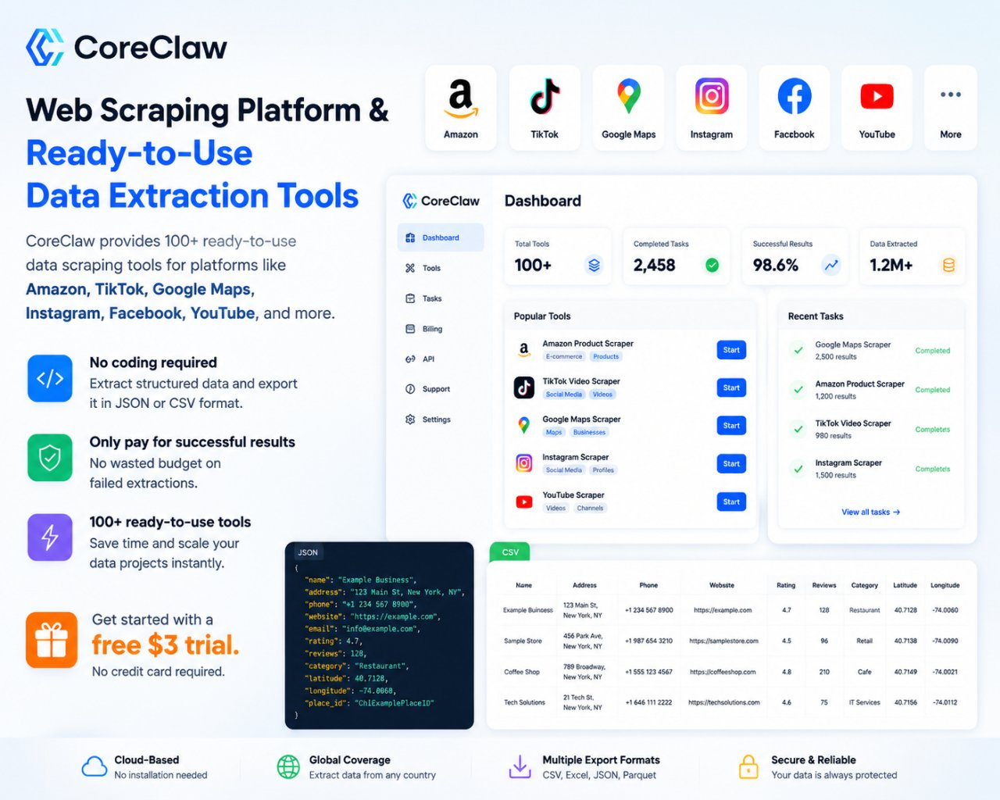

# Instagram Profile Scraper by Username ⚡📸

## ⚡ Sponsor
**[CoreClaw](https://www.coreclaw.com/zh/coreclaw/instagram-profile-scraper?utm_source=github&utm_medium=referral&utm_campaign=ins&utm_term=&utm_id=ins) — Web Scraping Platform & Ready-to-Use Data Extraction Tools**



CoreClaw provides 100+ ready-to-use data scraping tools for platforms like Amazon, TikTok, Google Maps, Instagram, Facebook, YouTube, and more.

- 🚫 **No Coding Required** — Extract structured data effortlessly.
- 🔄 **Flexible Formats** — Export seamlessly to JSON or CSV format.
- 🛡️ **Pay-Per-Success** — Only pay for successful results with no wasted budget on failed extractions.

### 🎁 Special Offer
**[Get started with a free $3 trial today!](https://www.coreclaw.com/zh/coreclaw/instagram-profile-scraper?utm_source=github&utm_medium=referral&utm_campaign=ins&utm_term=&utm_id=ins)**

---

## ✨ Overview
The Instagram Scraper is a project designed to extract data from public Instagram profiles. 
It utilizes web scraping techniques to gather information such as user details, posts, followers, and following, providing valuable insights for various analytical purposes.

---

## 🚀 Features
- 🔐 Enter your own CoreClaw API token at runtime
- 👤 Submit one or multiple Instagram usernames
- ⚙️ Start an asynchronous CoreClaw worker run
- 🔄 Poll task progress automatically
- 📊 View profile summary cards in the browser
- 🧾 Inspect and copy the full JSON response
- 💡 Use a static HTML/CSS/JavaScript stack with no build step

---

## 🧩 Worker Information
- **Worker ID:** `01KPD6M5YVHWCNQCRK3W1JD9W2`
- **Worker Name:** `instagram-profile-data-scraper`
- **Platform:** CoreClaw OpenAPI v2

---

## 🛠️ How It Works
This UI calls the CoreClaw API in three main steps:

1. `POST /api/v2/workers/{workerId}/runs`
   - Starts a new async scraping run
2. `GET /api/v2/worker-runs/{runId}`
   - Polls the run status until completion
3. `GET /api/v2/worker-runs/{runId}/result`
   - Retrieves the final scraping result

---

## 📦 Project Structure
```text
.
├── assets/
│   └── coreclaw-sponsor.jpg
├── index.html
├── main.js
├── README.md
└── styles.css
```

---

## ▶️ Run Locally
Because this is a static project, you can open it in multiple simple ways:

### Option 1: Open directly
Double-click `index.html`.

### Option 2: Serve it locally
Use any static file server you like.

Example with Python:

```bash
python -m http.server 8080
```

Then open:

```text
http://localhost:8080
```

---

## 🔑 Why the Token Is Not Hardcoded
This repository is intended to be public.

Hardcoding a real API token into frontend source code would expose it to anyone visiting the repository or inspecting the page source. To avoid leaking secrets, the UI is designed so that:

- 🔐 the token is entered manually by the user
- 🌐 requests are sent from the user's own browser
- 🧹 no real credential is stored in the repository

---

## ⚠️ Important Notes
- This is a **frontend-direct integration**.
- Anyone using the page must provide their own CoreClaw API token.
- This approach is convenient for testing, demos, and personal workflows.
- For a production-grade public app, a **backend proxy** is strongly recommended.

---

## 🖼️ Expected Result
Once a run succeeds, the page will display:

- profile summary cards
- follower / following / post metrics
- verification status
- biography preview
- full raw JSON output

---

## 📘 Tech Stack
- HTML
- CSS
- Vanilla JavaScript
- CoreClaw OpenAPI

---

## 💬 Use Cases
This project can be useful if you want to:

- explore the CoreClaw worker quickly
- test Instagram username scraping without writing code
- demo a browser-based scraper workflow
- prototype a richer internal dashboard later

---

## 🛡️ Security Reminder
Treat your CoreClaw API token like a password.

- Do not commit it to Git
- Do not paste it into public screenshots
- Rotate it immediately if it has been exposed

---

## 📄 License
Add your preferred license if you plan to reuse or distribute this project.
